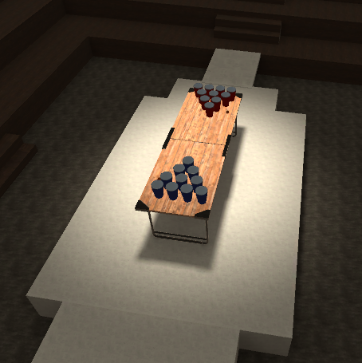
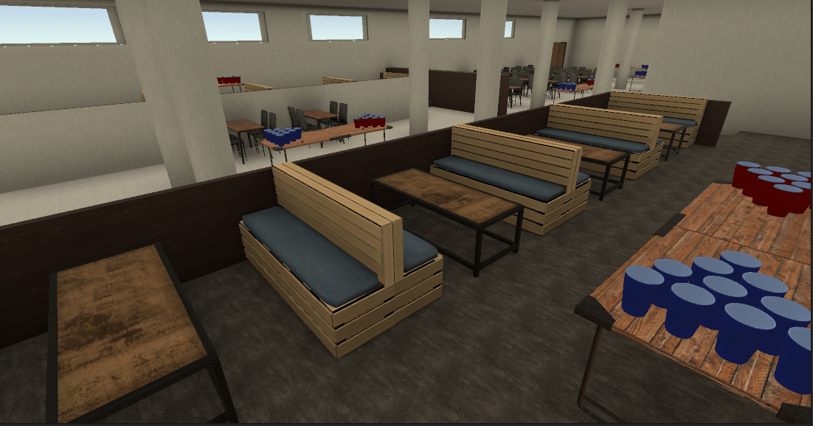
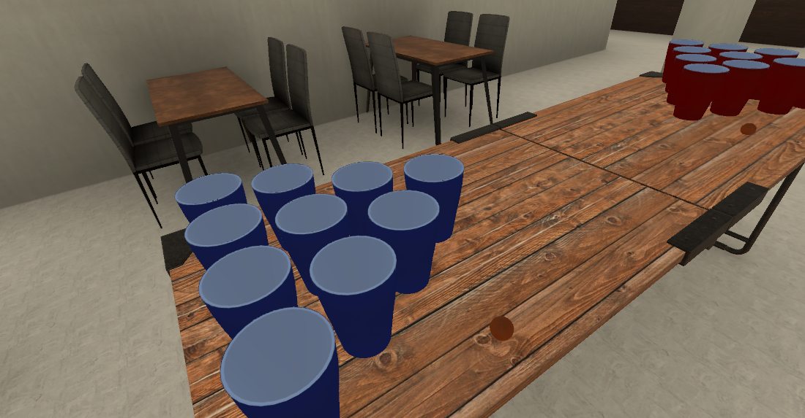

# VRPong
Have you ever wanted to play Beerpong in Virtual Reality? Well, then this game might be what you've been looking for!

This game aims to support your remote drinking needs, by allowing you and your friends to join one of two rooms *(currently)*
in which you can have fun in a *Sandbox* like environment with a multitude of Beerpong tables, cups, balls and support for
*Voice Chat*.
*Builds for both Oculus Quest standalone platforms, as well as tethered PC VR are being made.*

If this sounds interesting to you, then head to the *Releases* and download the most recent one to try it out for yourself!

Below are some screenshots of the game;

